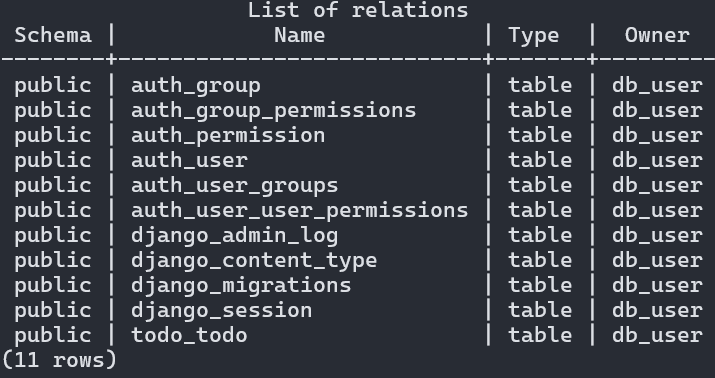
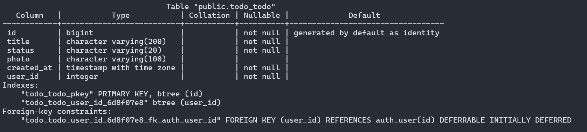

# Individual Project (Laboratory) Report  
**Phimnada Chirachotsuphaphat 6510545641**

---

## Framework

**Framework Used:** Django  
Django is a full-stack Python web framework selected for this project due to its comprehensive built-in features, including:

- Object-Relational Mapping (ORM)
- Admin interface
- User authentication
- Form handling
- Template rendering

These features are particularly well-suited for applications that involve task management, user input, file uploads, and dynamic rendering of to-do lists. Django's modular and scalable architecture promotes maintainable and organized code, supporting long-term development and extensibility.

---

## Database

**Database Used:**
- **PostgreSQL** is used to store structured, relational data such as authentication information and todo items.
  

  **Table:** `todo_todo` - This table stores todo items, including the following fields: id, title, status, photo, created_at, and user_id.
  

- **MinIO** - Used to store and retrieve user-uploaded images associated with todo items.

---

## GitHub Repository

- [https://github.com/PHIMNADA024/todo_list](https://github.com/PHIMNADA024/todo_list)

---

## Application Deployment

Follow these steps to deploy the application on your local machine:

### 1. Clone the Repository

First, clone the repository from GitHub to your local machine:

```bash
git clone https://github.com/PHIMNADA024/todo_list.git
cd todoproject
```

This will create a local copy of the repository and navigate you into the project folder.

### 2. Create a `.env` File for Configuration

The application uses externalized variables, which are stored in the `.env` file. You need to create this file to set up the application environment.

**For Linux and macOS:**

```bash
cp sample.env .env
```

**For Windows:**

```cmd
copy sample.env .env
```
This will copy the default values from sample.env to the .env file, which is where your configuration settings will live.

### 3. Start the Application

Now, use Docker to build and start the application in detached mode (in the background):

```bash
docker compose up --build -d
```

This command will download the necessary Docker images, build the containers, and start them. The -d flag runs the containers in the background.

### 4. Access the Application

Once the app is up and running, you can access it by opening your browser and navigating to:

```
http://localhost:8000
```

### 5. Stop the Application

To stop the application and clean up the resources (including volumes), run:

```bash
docker compose down --volumes
```
This will stop all running containers and remove volumes to ensure no leftover data or resources.

---

## Code Explanation

### Structure

This Django project follows the **MVT (Model-View-Template)** architecture:

- **Model** – Handles data and database structure  
- **View** – Contains business logic and connects models to templates  
- **Template** – Manages the front-end and user interface  

### File Overview

- `forms/todo_form.py`  
  Handles the form used to create and update to-do items using Django's ModelForm.

- `models/todo.py`  
  Defines the `Todo` model, which stores the to-do items linked to a user.

- `templates/todo/base.html`  
  Base HTML layout used by other templates for consistent styling and structure.

- `templates/todo/login.html`  
  Login page where users can enter their credentials to access the app.

- `templates/todo/signup.html`  
  Signup page for new users to register an account.

- `templates/todo/todo_list.html`  
  Displays the user's to-do list with options to add, update, or delete items.

- `views/authentication_view.py`  
  Handles user authentication: signup, login, and logout functions.

- `views/todo_features_view.py`  
  Manages to-do item operations: list, add, update, and delete tasks.
